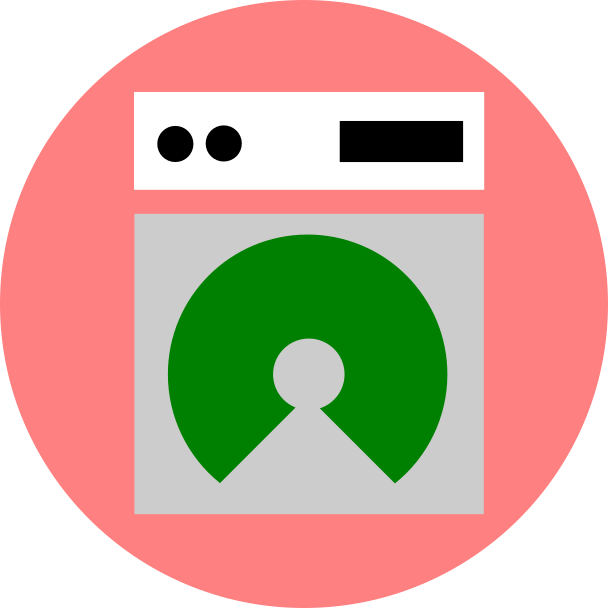

# openlaundry

Open source laundry PoS management system

### Features
- Works offline with cloud synchronization support (WIP) if needed
- Flutter codebase supports Android (binary release available) Web, and also iOS (codebase only)
- Client-heavy app

If you have any inquiries or pull request approval to support the non-prioritised platforms (Web & iOS), feel free to open issues or contact me at valianmasdani@gmail.com
